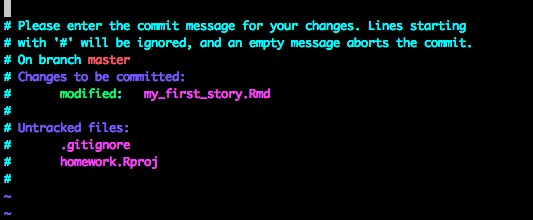

Sometimes when making a commit with git, you forget the -m and get dumped into a wild wonderland, known as vi.  It looks something like this:

 

Oh no! What happened! What do I do!  You may flail, type "q", escape, and other things, and yet, to no avail.

OK, what do you do.  The short answer to get out is to type the following - ":q"

In vi, ":" allows you to begin to enter commands for vi. "q" is quit.  If you have entered no text, then vi will dump you out with no commit made. Now start your commit process over.  

Forget vi ever came into your life, sip your coffee, and move on. Nothing to see here.

### But I WANT to use a text editor to write longer commit messages

Oh, hello. There's a REASON for text editors for commits. You can write longer more detailed messages on your commits that are more useful for your collaborators.  OK, so, you have a few options to text editor nirvana.

**A) Use vi. Simply.**

  vi is actually **incredibly** powerful. If you're interested in it, read up. 31337 h4X0r5 love it. Unless they are emacs fiends. But that is neither here nor there.
  
  You, however, might want to do something simple - just add text, save it, and commit.  This is actually quite straightforward.
  
>  First - type "i" to "insert" text.

>  Second - type. You can enter text freely.

>  Third - hit "escape" to get back to where you can enter commands.

>  Fourth, type ":wq"  This stands for write-quit.
  
BOOM!  Done.

**B) Change to another text editor.** There are other text editors out there that are easier to use. My personal favorite is [nano](http://www.nano-editor.org/). It's installed by default on OSX. You'll have to go to the previous link to get it for windows. What's great is that there's always a menu there at the bottom of the screen when you run nano that tells you the keystrokes to save some output and quit nano.

Once you've installed nano, in your shell the following command will set it as your editor:

> git config --global core.editor "nano"

That's it!  Now you can commit without the "-m", write longer commit messages, and then save them and quit your text editor with ease!