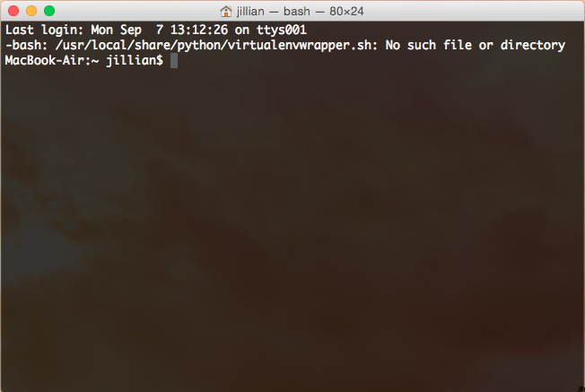

  

### Please install the following programs prior to coming to class.  
  

#### 1) Install R

{:.table}
OS              | R                                            |
--------------- | -------------------------------------------- |
Mac             | http://cran.r-project.org/bin/macosx/        |
Windows         | http://cran.r-project.org/bin/windows/base/  |
Linux (Ubuntu)  | https://cran.r-project.org/bin/linux/ubuntu/ |

  
#### 2) Install Rstudio

All platform downloads available here
https://www.rstudio.com/products/rstudio/download/  
  

#### 3) Install Git
If you are using a Mac or Windows, you can install the latest versions of git from the following links. Download and run the installers. In most cases this should work. However, if it does not, send me an email asap. 

{:.table}
OS              | Git                                          |
--------------- | -------------------------------------------- |
Mac             | http://git-scm.com/downloads                 |
Windows         | https://git-for-windows.github.io/           |

*Possible error message*
If you're on a Mac and you the the error: "App can't be opened because it is from an unidentified developer", right-click the application and choose 'Open'. Then click the 'Open' button at the next dialogue warning.  

##### **Linux**
You will most likely use your standard package-manager 

{:.table}
Distro                     | command                        |
-------------------------- | ------------------------------ |
Debian-based/Ubuntu        | sudo apt-get install git       |
Fedora                     | sudo yum install git           |

#### After the installer
Once you have followed the install directions (followed the installer dialogue boxes), you will notice that there is no icon or folder that comes up. Not to worry, unless there was some kind of error Git likely installed properly.  

On a Mac, go to Spotlight (the little magnifying glass in the upper right hand corner of your desktop) and type 'terminal'. A box should open, that should look something like this (but yours is likely white - you can change the colour under Terminal > Preferences).

**Screenshot of my terminal**  

Then type

~~~
git --version
~~~

#### 4) Create a Github account

Please create an account even if you cannot install git on your local computer.  
https://github.com/  

#### 5) Free stuff!
On Github Request an education discount! They have created a student developer pack with free access to various tools that are worth checking out! I recommend requesting your educational discount now, as these take time to process. 
https://education.github.com/discount_requests/new  

#### Troubleshooting
If you have problems installing these programs prior to class. Please email me asap. We will have some time dedicated at the start of class to troubleshooting. For those of you who already have some experience with these programs, please assist your neighbours in class who may be having troubles.  

#### Success and more?
If you are successful in setting up your computer and would like to get your feet wet in R, you can also install the package 'Swirl' and try some of the interactive tutorials. 

Follow the information at this link to start working with Swirl: http://swirlstats.com/students.html  

------------------------------------------------------------------------------------------

####Terminal Tinkering -- for Mac and Linux users only
Please attempt to play, even for 10 minutes with your terminal. This may be completely new to most of you.

**Note** - a directory is just a folder. 

#####Opening a terminal
Mac  
Type 'terminal' into spotlight  

Now that you have a terminal open try the following commands  

*Change directory to home directory (the ~ means home)*

~~~
cd ~  
~~~

This should put you in your home directory

*List* all *files in your directory*

~~~
ls -a
~~~

*Change directory (type the name of one of the directories that you found in ls -a)*

~~~
cd type_directory_name_or_path_here
~~~

*Get the path to your current directory*

~~~
pwd
~~~

*Go back to the directory one level up (no space between the periods)*

~~~
cd ..
~~~

**Did any of you have any errors that came up?**

"No such file or directory"
One possible error is that when you typed in a directory name it contained spaces or some other special character. This error occurred because a space is considered to be a special character. Other special characters include things like $, *, /. In order to include them in a string (a normal set of letters or numbers) you must escape them by putting a backslash, \, in front of them. E.g:

~~~
cd my\ filename\ with\ spaces
~~~

Another, usually easier option is to use **tab completion**. We can demo that in class since we'll use it often. All you do is start typing a word, hit tab, and the terminal will try and auto-complete what you've typed. That way you don't have to worry about dealing with the escapes.

A list of special characters in the terminal (specifically a Bash terminal) can be found [here](http://mywiki.wooledge.org/BashGuide/SpecialCharacters)

####Further reading for terminal use
More commands can be found here if you are interested in learning more. But for now I just want you to have some exposure. 
[http://cli.learncodethehardway.org/book/ex1.html](http://cli.learncodethehardway.org/book/ex1.html)

