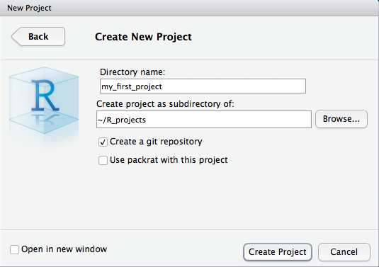
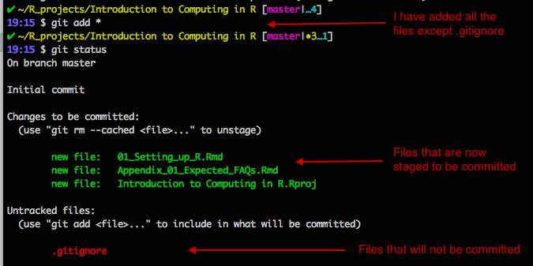
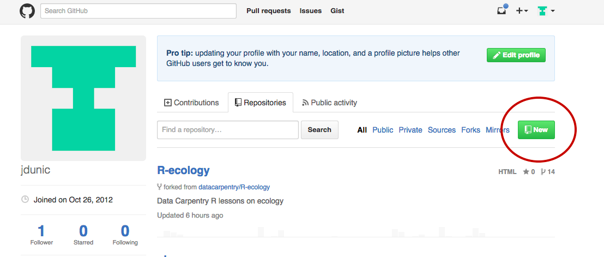

I'm assuming that you have installed R and Rstudio by now. If you have had any problems, please start an issue on the Github page or, if we haven't gotten there yet, send me an email. You should also log in to your Github accounts now. We will be using them later in the class. Don't forget to request your educational discount on your Github account!  

*It is also a good practice to make a directory that contains all of your R projects in one place. I have a directory called R_projects.  

Following this walkthrough, we're going to tell RStudio to initiate a git repository that will be for our homework. Then we will integrate our git workflow with RStudio. 

#### Rstudio projects

Let's start by creating an Rstudio project. A project is basically a special folder that contains all of the work that you do in Rstudio in that project file. It helps your keep your different projects organised. I suggest that you create a project that will contain all of the work that you do in this course. I use projects to keep track of the code for my manuscripts and R packages that I may be working on. 

When you open Rstudio you can create a new project by:
File -> New project

You'll be prompted with a dialog box

Add a new directory called homework, or something along those lines. Note, this does not need to match up with what you will call your repository on Github. Something short and sweet works just fine. As I mentioned before, I would recommend that you add this new homework directory to your R\_projects folder, or in another folder like R\_projects/Biol_653. 

If this dialogue box shows up, but does not give you the option to create a git repository, let me know. Create a git repository, this means that RStudio will take care of the `git init` command that we used in the intro to git walkthrough. This will create a local repository, telling git that we want to track changes in our selected directory.

#### Rmarkdown (html)

Before we jump into coding, let's just make our first text file. We're going to start with a special type of file called Rmarkdown. These types of text files are great! They allow us to write text and embed code, the results of that code, and input figures! It is how I have created this walk-through. We'll start with an html document. These are the most flexible and can be converted to a PDF or MS Word document later.   

Let's create our first Rmarkdown file. This is easy in Rstudio!  
File -> New file -> Rmarkdown...  

Now fill in the title of your document and your name. For now let's select the HTML option.   

Now you should have an R Markdown document! You can modify the information at the top of the script as you'd like. You can also start one of these from scratch as just a raw text file but Rstudio sets it up nicely for you :)  

Write some stuff Just so you can see it.   

#### Tracking our changes -- let's use git!

Instead of using git within Rstudio, let's get more practice using the command line/terminal.   

Let's open terminal (Mac users can just go to spotlight and type in terminal)  

**By keyboard**: 'Press "Win-R," type "cmd" and press "Enter" to open a Command Prompt session using just your keyboard.'  
**By mouse**: 'Click the "Start | Program Files | Accessories | Command Prompt" to open a Command Prompt session using just your mouse.'  

Let's look back at the notes from yesterday's class.

How do we change directories via the terminal?  
A: 

~~~
cd path
~~~

What's the first thing we should do when we go to use git?
A: Check the git status and check what branch we are on. We can do this with 

~~~
git status
~~~

Let's stage some files for a commit. You can play with this if you'd like. You can do git status after everything you do to see what's going on.

~~~
git add file_name
~~~

or 

~~~
git add .
~~~

*if you would like to add all the changes that you have made

Great where are we now? If we check git status now, what do you see? Is it something like this?

Everyone should now have some files staged and ready to be committed. Let's commit and include a message.

~~~
git commit -m 'initial commit'
~~~

Awesome. Any questions? Again, turn to your neighbour if you are having any issues. 

#### Using remote repositories

What we have done now is kept track of our changes on our local computer. But let's now send those changes to a remote repository. Let's all go to our Github pages so that we can create an online repository. 

Now is when we're going to hook up Github with git. Go to your account hit the big green button on our profile page that says 'New'

Great. We've now made another repository. If this is your homework directory, name it: BIOL-653-lastname-firstname. Now copy the link to this repository. It should look something like:  
https://github.com/jdunic/Intro-To-Practical-Computing-R  
With your username/repo_name

Now we need to go back to our terminal and initiate this online repository.
Add the URL by doing something like (note, you're not jdunic!):

~~~
git remote add origin https://github.com/jdunic/Intro-To-Practical-Computing-R.git
~~~

Note!!! That we have added '.git' to the end of our URL. If you're getting an error make sure you've typed everything in exactly. Then ask your neighbour to take a second look.

You can check that this all worked by doing

~~~
git remote -v
~~~

You should see something like this.  

~~~
# origin  https://github.com/user/repo.git (fetch)
# origin  https://github.com/user/repo.git (push)
~~~

What is this 'origin' business? Origin is a convention that we use to name our remote repository. So when you see 'origin', this is really saying, the remote repository found at some URL.  

Is this all set up for everyone?  

Now we are going to prepare to *push* our local changes to our remote repository. But first, it's a good habit to *pull* any existing changes from the remote (online) repository. 

~~~
git pull -u origin master
~~~

If we translate this into English, this says, git, pull any changes on the remote master branch to my local computer. For the next couple weeks, we will only be working with the master branch. Remember that I've talked about how you can fork and create different versions of things? We give these names, and by convention the main branch is called 'master'. Typically you want your master branch to consist of working code.  

After you did this, did you get to an odd looking screen that asks about writing a merge commit? You may have entered into a text editor that runs within the terminal. Because it works within the terminal, you can't navigate around the text using the mouse. Instead you use the arrow keys (and other shortcuts). Read more [here](commit_vi.html) and learn how to escape this.

Now that we've *pulled* any changes that might have been on our remote repository. We can go ahead and *push* our local changes to the remote repository. 

~~~
git push origin master
~~~

The translation of this is, git, push our local changes on the master branch, to the origin (remote repository).  

This may still feel tricky and over your head. If it does I recommend that you see me in office hours tomorrow and practise one more time on your own. We can do another practice run through at the end of next class if people would like to. The goals is that we do this enough times throughout the semester, that by the end, this should seem trivial. We'll get there!

References:
Setting up a remote repository
https://help.github.com/articles/adding-an-existing-project-to-github-using-the-command-line/

